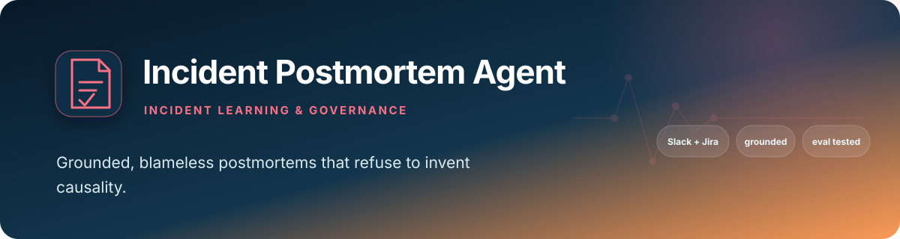
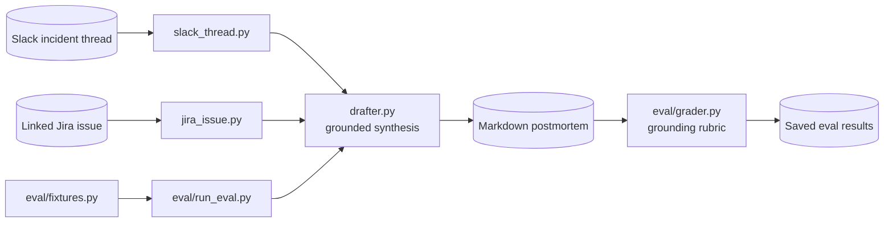

# Incident Postmortem Drafting Agent

### *Blameless incident synthesis, prompted to refuse to invent causality*

<div align="center">

[](https://www.python.org/)
[](https://www.anthropic.com/)
[]()
[-eda100?style=for-the-badge)](eval/)
[](https://github.com/PlainJane20/incident-postmortem-agent/actions/workflows/ci.yml)
[](LICENSE)

</div>

Drafts a structured, blameless postmortem from a Slack incident thread and
its linked Jira ticket — timeline, impact, root cause, action items, and
open follow-ups, with the strictest grounding prompt in this portfolio (enforced by
the prompt and checked offline by the eval, not verified at generation time):
**an invented root cause is worse than an honest "not established."**

**Why this exists:** the highest-stakes artifact a TPM produces isn't a
status update, it's a postmortem — it decides what the org spends the next
sprint fixing. If the root-cause section is confidently wrong, that's not a
cosmetic bug, it's actively harmful. This agent is built to be honest about
uncertainty rather than fluent about it.

## At a glance

| | |
|---|---|
| **Problem** | Incident evidence is fragmented, while an unsupported root cause can redirect engineering toward the wrong fix |
| **Approach** | Join Slack chronology and Jira context, then draft a structured postmortem with explicit uncertainty |
| **Pattern** | Not an agent: fetch inputs, one Claude call, output (see [Architecture pattern](#architecture-pattern)) |
| **Evaluation** | Five adversarial grounding fixtures; four automated passes and one fail on a single saved run (the grader returned an empty tool call) |
| **Output** | Blameless timeline, impact, causal chain, actions, owners, and unresolved follow-ups |

## Architecture pattern

**Not an agent: a single-call drafting pipeline.** `run_postmortem.py` fetches the Slack thread (`slack_thread.py`) and optional Jira issue (`jira_issue.py`), `drafter.draft_postmortem` makes one Claude call with a fixed grounding prompt, and the text is printed or saved. There is no loop, tool use, planning, state or second model pass, so "agent" in the repo name describes a task-specific tool, not an agentic architecture. (The `eval/` grader is test tooling and is not part of the runtime path.)

- **Deterministic vs model-driven:** Fetching and formatting the inputs, and the output step, are deterministic. The whole document, including the grounding discipline, rests on one model call; nothing in code verifies that the draft is faithful to the thread.
- **Human gate:** None in the tool; a person is expected to review the draft before using it.
- **Honest limit:** Grounding is enforced only by the system prompt and checked offline by the five-fixture eval, so an unsupported claim in a live draft would not be caught by the tool.
- **Tracing:** optional OpenTelemetry spans for `draft_postmortem` and the eval grader are described in [docs/TRACING.md](docs/TRACING.md); a no-op unless configured.

## Architecture



## Competencies demonstrated

| Competency | Observable evidence |
|---|---|
| Incident governance | Produces a blameless, decision-ready learning artifact |
| Evidence discipline | Separates stated facts, inferred sequence, and unknown causality |
| Cross-system integration | Reconciles Slack discussion with linked Jira context |
| AI evaluation | Tests the exact failure mode that matters: unsupported causal claims |
| Engineering integrity | Reports the grader defect instead of silently rerunning until the score appears perfect |

## Adversarial evaluation, not drafting

> **Why I built it:** to get real practice designing an adversarial
> hallucination-detection eval suite. The five fixtures target invented
> root causes, invented owners/action items, invented impact, and treating a
> Jira ticket as evidence of a cause. There is **no fixture that specifically
> tests invented timestamps** (the live run below showed it avoiding them,
> but that was not an eval).

"AI drafts a postmortem" is now table-stakes — incident.io's Scribe,
Rootly's AI Copilot, PagerDuty's Scribe Agent, and FireHydrant's AI-drafted
retrospectives all ship that today. The harder, less commoditized part is
the eval harness above. See the next section for what it actually found —
including a bug in the harness itself, disclosed rather than hidden.

> **Related work in this portfolio:** shares the credential-propagation
> bug pattern (and fix) with [exec-status-rollup](https://github.com/PlainJane20/exec-status-rollup),
> and adapted its eval harness structure from [slack-daily-brief](https://github.com/PlainJane20/slack-daily-brief) —
> see the next section for how copying a working pattern without
> re-checking its assumptions reproduced a bug already fixed once.

## Real, live proof — not a scripted demo

Posted a real 5-message incident thread into a real Slack channel, linked it
to a real (unrelated) Jira ticket, and ran the actual CLI — see
[`sample_output.md`](sample_output.md) for the unedited result. Three things
worth noting about what it did *unprompted*:

1. **Traced the root cause chain and stopped honestly** when the thread's
   information ran out ("The thread does not go further into why... so the
   chain stops here") instead of speculating further.
2. **Distinguished stated timing from inferred sequence** — flagged that
   exact elapsed time between steps wasn't given, rather than inventing
   precise timestamps to fill the Timeline section.
3. **Noticed the linked Jira ticket was unrelated to the incident** and said
   so explicitly in Open Follow-ups instead of forcing a connection because
   a ticket was provided. The eval's fifth fixture tests a related
   Jira-grounding case (a ticket that exists but states no cause must not be
   treated as evidence of one). No fixture tests a fully *unrelated* ticket,
   so this live observation is a single anecdote, not a measured result.

## The eval harness caught something about itself, not just the agent

5 fixtures targeting the grounding failure mode specifically (root cause
traceable vs. never established, unassigned needs vs. committed action
items, stated vs. unstated impact, Jira context not substituting for thread
facts). The saved result (`eval/results/run_2026-08-26T00-45-52.json`) is a
**single run**: 4/5 passed. The 4 passing fixtures each had zero
hallucinations flagged; the failing one is described below.

The 5th fixture, `root_cause_never_established`, was recorded as a fail
with empty `matched_expected` and `hallucinations` lists and the reasoning
`(missing from grader output)`. That is the signature of the judge returning
an empty tool call: `_normalize` fills in `verdict` as `"fail"` by default.
So the fail reflects a grader output problem, not a judged failure of the
agent. I read the raw output manually and it correctly declined to invent a
cause, but that is my manual reading of one run, not an automated result,
and the 4/5 figure was never re-run to confirm. The grader now retries once
on an empty/verdict-less tool call (covered by offline unit tests with a
stub client); this has not been re-run against the live API, so there is no
new eval result. If the retry also comes back empty, the conservative
`"fail"` default still applies.

That is the same failure mode seen elsewhere in this portfolio
(`exec-status-rollup`, `slack-daily-agent`, `spec-review-agent`): a forced
tool schema does not guarantee the model populates required fields, here in
the *judge* rather than the agent under test. Note that defaulting to
`"fail"` is a safe-side choice but it conflates "judge broke" with "agent
failed", which is why the retry and this disclosure exist.

## Known limitations

- **Tiny eval:** 5 synthetic fixtures, one saved run, no repeated runs or
  variance estimate. 4/5 is not a reliable pass rate.
- **Judge is an LLM:** `must_not_mention` is passed to the judge in its
  prompt and judged by the LLM; it is not matched deterministically (no
  string/regex check). The same model family drafts and judges.
- **Grader failures are indistinguishable from fails** in the saved
  verdict, apart from the `(missing from grader output)` reasoning string.
- **Untested behaviours:** invented timestamps (no fixture), a fully
  unrelated Jira ticket (live anecdote only), and multi-thread or long
  incidents.
- **13 offline unit tests** (`tests/`, stubbed clients, no network or keys): 3 cover the
  grader retry (`test_grader.py`) and 10 cover the optional OpenTelemetry tracing
  (`test_tracing.py`: span attributes, no-op by default, no sensitive strings in spans, outputs
  unchanged). Without `opentelemetry-sdk` installed the tracing module is skipped (3 passed, 1
  skipped). The drafter's prompt/output quality, Slack/Jira fetching and the eval runner have no
  automated tests.
- **Live proof is one incident:** the sample output is a single
  hand-posted 5-message thread.

## A second real bug, from copying a working pattern into a different context

`grader.py` was adapted from `slack-daily-agent`'s eval harness, which reads
`ANTHROPIC_API_KEY` from `os.environ` directly — safe there, because that
repo's config has no fallback chain. This repo's `config.py` *does* resolve
credentials via a sibling-repo fallback into a plain dict that's never
exported back into the process environment — the exact same bug already
found and fixed in `exec-status-rollup`'s `narrator.py`. Copying a working
pattern without re-checking its assumptions against a different context
reproduced a bug I'd already fixed once. Fixed the same way: pass the key
as an explicit argument, not an implicit environment read.

## Setup

```bash
python3 -m venv venv
source venv/bin/activate
pip install -r requirements.txt
cp .env.example .env   # or leave blank to reuse sibling repos' credentials
pip install -r requirements-dev.txt && python -m pytest tests/ -v   # 13 offline tests (grader retry + tracing)
```

## Usage

```bash
python run_postmortem.py --channel incident-room --thread-ts 1787705276.984169
python run_postmortem.py --channel incident-room --thread-ts <ts> --jira PGMAUTO-4 --out postmortem.md

# Eval harness
python eval/run_eval.py --save
python eval/run_eval.py --compare eval/results/run_<timestamp>.json
```

## License

MIT — see [LICENSE](LICENSE).

## Contact

<div align="center">

### **Navi Sohi**
*Technical Program Manager & Automation Engineer*

<br>

[](https://www.linkedin.com/in/navisohi/)
[](https://github.com/PlainJane20)
[](https://mail.google.com/mail/?view=cm&fs=1&to=nks.ai.dev@gmail.com)

<br>

</div>
